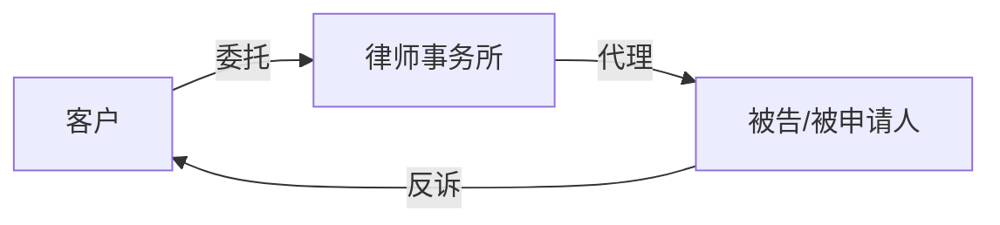
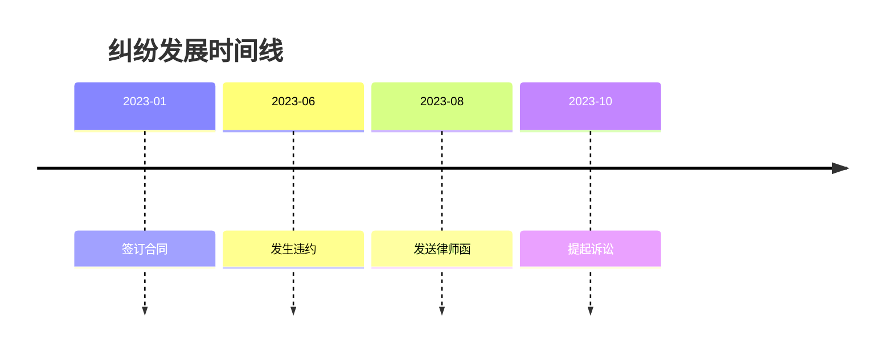
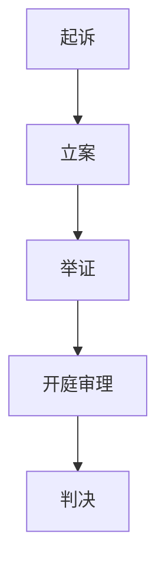

# 法律文档可视化指南

## 概述

法律文档中的可视化元素（图表、流程图等）应当服务于内容理解，而非装饰。本指南适用于所有法律服务文档类型。

## 适用场景

| 场景 | 推荐图表 | 适用文档类型 |
|------|---------|-------------|
| 复杂的当事人关系网络 | 关系图谱 | 诉讼服务方案、沟通报告 |
| 多阶段的纠纷发展过程 | 时间轴 | 诉讼服务方案、咨询报告 |
| 诉讼或仲裁各环节 | 程序流程图 | 诉讼服务方案 |
| 服务阶段划分 | 阶段划分图 | 非诉方案、建议书 |
| 风险与应对关系 | 风险矩阵图 | 沟通报告、非诉方案 |

## 制作原则

1. **与正文一致** - 图表必须与正文描述一致，只做补充说明
2. **保持简洁** - 节点少、文字短、结构清晰
3. **配以说明** - 每张图后配1段说明文字

## Mermaid 语法示例

### 关系图谱

### 时间轴

### 程序流程图

### 阶段划分图

## 使用建议

- **必要性优先** - 只在确实能帮助理解时使用
- **位置恰当** - 图表应紧接相关文字说明
- **统一风格** - 同一文档内图表风格保持一致
