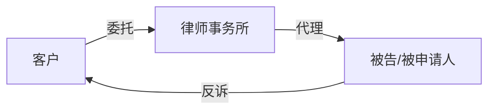
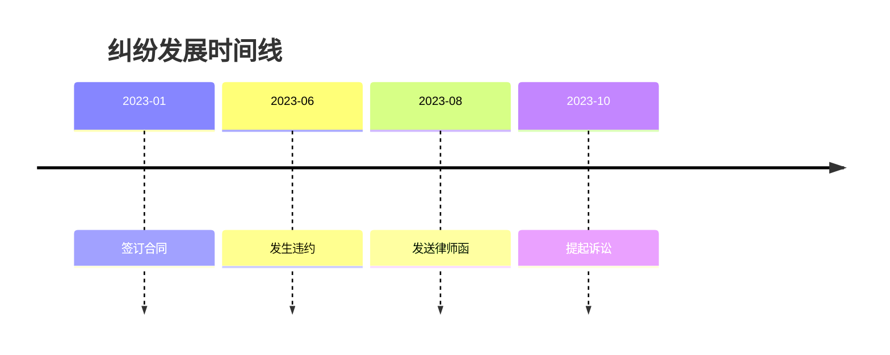
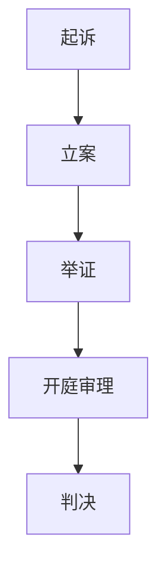

# 法律文档可视化指南

## 概述

法律文档中的可视化元素（图表、流程图等）应当服务于内容理解，而非装饰。本指南适用于所有法律服务文档类型。

## 外部可视化 skill 路由

在以下情形之一，**优先扫描当前可用的可视化类 skill** 产出高保真图件，再插入正文：

- 案件/项目涉及多主体、多合同或复杂资金/票据/货物/股权流转（关系图谱）
- 案件/项目时间跨度长、节点多（时间轴）
- 诉讼/仲裁程序有清晰阶段划分（程序流程图）
- 服务方案需要展示阶段、交付物、报价（路线图 / 范围-交付物矩阵）
- 风险、合规或证据链需要矩阵化呈现

**路由规则（按下列优先级顺序）**：

1. **用户明确指定**：用户说"用 X 配图"或"按 X 风格出图"，按用户指定调用。
2. **领域匹配**：扫描当前可用的可视化 skill 列表（参考其 `description` 字段），找出描述里包含「法律 / 案件 / 合同 / 证据 / 流程 / 关系 / 时间轴 / drawio / 法律服务方案 / 客户汇报」等关键词的。**当前默认首选 `legal-visualization`**，因为它专门面向法律业务场景，支持 `.drawio` / `.svg` / `.png` / `.pdf` 输出，天然适合嵌入法律文档。
3. **形态匹配**：若用户需要的是海报、宣传图、品牌视觉等艺术化输出而非法律图表，则改用 `canvas-design`（静态视觉设计）或 `web-artifacts-builder`（网页型制品）。
4. **回退**：当前环境没有任何合适的可视化 skill 时，退回本指南的 Mermaid 方案内联生成。
5. **不硬编码**：路由表是建议而非绝对规则。**不要在配置里写死"必须调用 legal-visualization"**——如果未来出现新的、描述更贴当前任务的 skill，按规则 1-4 选用。

**调用约束**：

- 调用外部 skill 前，先用一句话告知用户「正在用 X skill 出图，输出将插入到 Y 段落」。
- 外部 skill 输出的图件必须以**绝对路径**形式插入 Markdown（``），并紧贴对应文字段落之后。
- 同一段落内外部图与 Mermaid 内联图不要重复出现，二选一即可。
- 外部 skill 通常有自己的「缺失事实必须标注」硬约束，把这种标注一并保留到最终文档。

## 适用场景

| 场景 | 推荐图表 | 适用文档类型 |
|------|---------|-------------|
| 复杂的当事人关系网络 | 关系图谱 | 诉讼服务方案、沟通报告 |
| 多阶段的纠纷发展过程 | 时间轴 | 诉讼服务方案、咨询报告 |
| 诉讼或仲裁各环节 | 程序流程图 | 诉讼服务方案 |
| 服务阶段划分 | 阶段划分图 | 非诉方案、建议书 |
| 风险与应对关系 | 风险矩阵图 | 沟通报告、非诉方案 |

## 制作原则

1. **与正文一致** - 图表必须与正文描述一致，只做补充说明
2. **保持简洁** - 节点少、文字短、结构清晰
3. **配以说明** - 每张图后配1段说明文字

## Mermaid 语法示例

### 关系图谱

```mermaid
graph LR
    A[客户] -->|委托| B[律师事务所]
    B -->|代理| C[被告/被申请人]
    C -->|反诉| A
```

### 时间轴

```mermaid
timeline
    title 纠纷发展时间线
    2023-01 : 签订合同
    2023-06 : 发生违约
    2023-08 : 发送律师函
    2023-10 : 提起诉讼
```

### 程序流程图

```mermaid
flowchart TD
    A[起诉] --> B[立案]
    B --> C[举证]
    C --> D[开庭审理]
    D --> E[判决]
```

### 阶段划分图

```mermaid
graph LR
    A[第一阶段<br>尽职调查] --> B[第二阶段<br>方案设计]
    B --> C[第三阶段<br>实施落地]
```

## 使用建议

- **必要性优先** - 只在确实能帮助理解时使用
- **位置恰当** - 图表应紧接相关文字说明
- **统一风格** - 同一文档内图表风格保持一致
