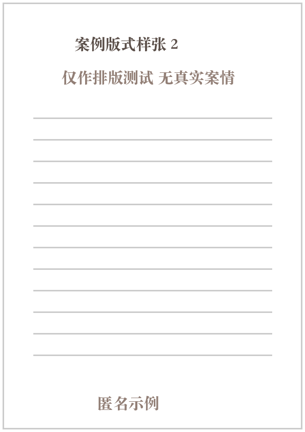
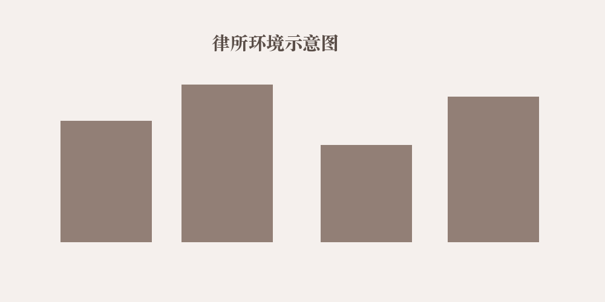

## 基本信息

- law_firm: 示例律师事务所
- lead_lawyer: 测试律师甲

## 主办律师介绍
<table>
<!-- 测试律师甲 -->
<tr><td></td><td><strong>测试律师甲 / 律师</strong> <strong>教育背景：</strong>示例院校法学专业，仅作版式占位 <strong>服务企业：</strong>示例企业甲、示例企业乙 <strong>专业领域：</strong>示例业务领域与项目协作</td></tr>
<!-- 测试律师乙 -->
<tr><td></td><td><strong>测试律师乙 / 律师</strong> <strong>教育背景：</strong>示例院校法学专业，仅作版式占位 <strong>服务企业：</strong>示例企业甲、示例企业乙 <strong>专业领域：</strong>示例业务领域与项目协作</td></tr>
</table>

## 相关法院判决书

## 律所简介

示例律师事务所为本次版式核验使用的虚构机构。其名称、介绍和所有附页均不代表真实服务资历。

本段用于测试图片之后的正文是否保持原有顺序。后续可以在 Word 中直接调整文字与图片。

机构介绍应当保留来源材料的完整段落，不因模板限制而静默截断。

第四段用于检验长于三段的介绍是否仍能完整输出。

## 律所荣誉

- 荣誉样例 1（仅作排版测试）
- 荣誉样例 2（仅作排版测试）
- 荣誉样例 3（仅作排版测试）
- 荣誉样例 4（仅作排版测试）
- 荣誉样例 5（仅作排版测试）
- 荣誉样例 6（仅作排版测试）
