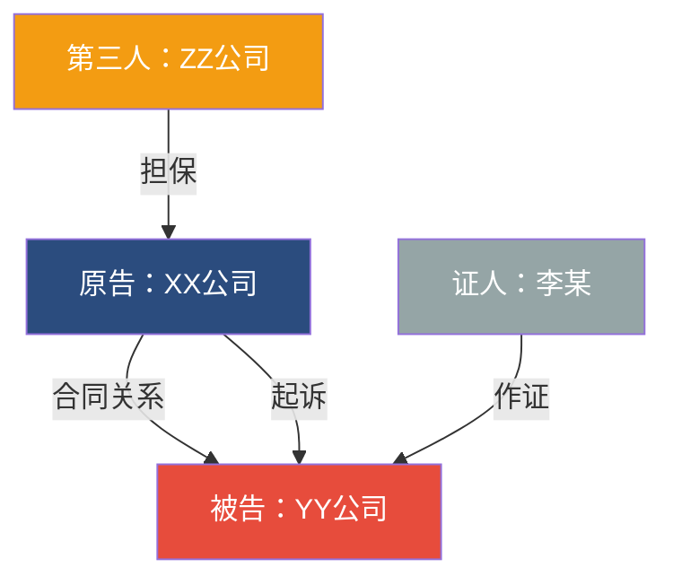
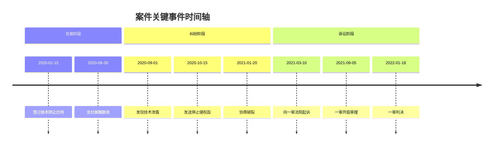
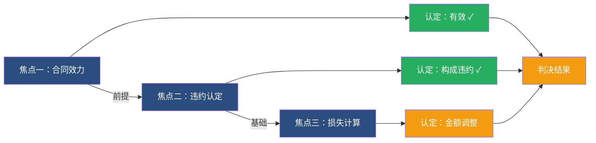
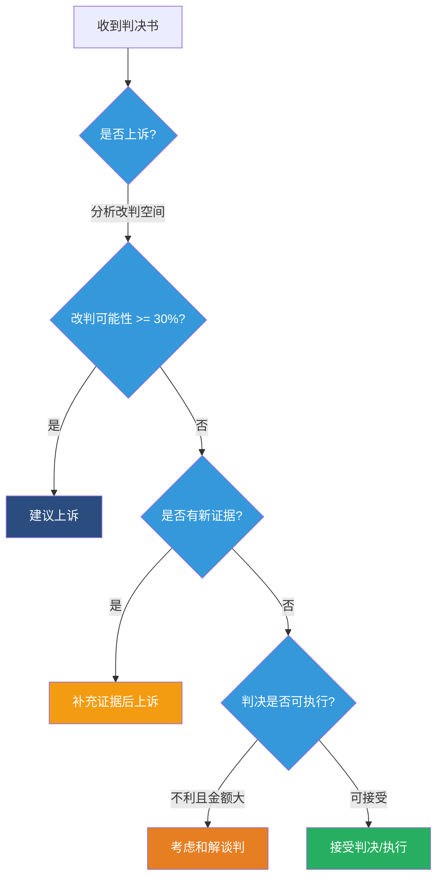
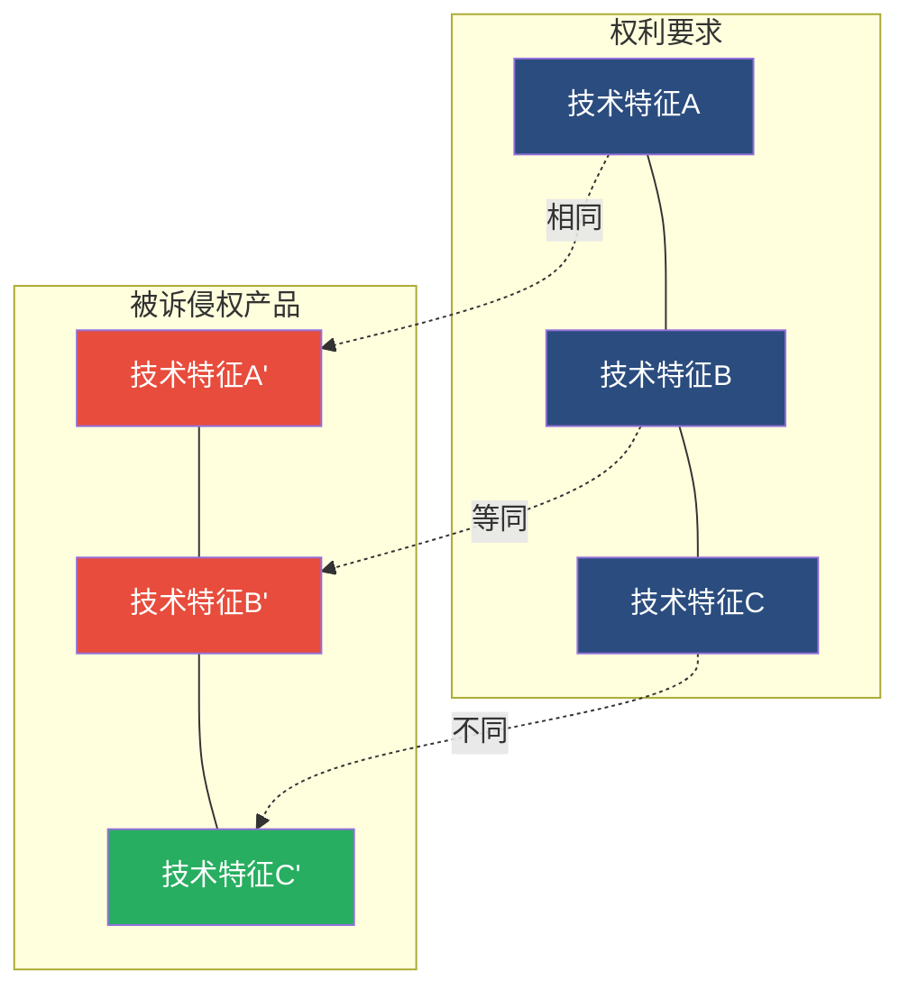

# 判决书分析可视化指南

## 概述

判决书分析报告中的 Mermaid 图表用于将复杂的案件信息可视化，帮助律师快速理解当事人关系、时间脉络、争议逻辑和策略路径。本指南定义了在内部版和客户版报告中应生成图表的场景和规范。

## 适用场景与图表类型

| 场景 | 推荐图表 | 报告版本 | 所在章节 |
|------|---------|---------|---------|
| 当事人关系网络 | 关系图谱 | 内部版 | 一、1.2 当事人关系图 |
| 案件关键事件脉络 | 时间轴 | 内部版 | 一、1.3 案件时间轴 |
| 争议焦点与裁判逻辑 | 流程图 | 内部版 | 三、争议焦点关系图 |
| 上诉策略决策路径 | 决策流程图 | 内部版 | 五、5.2 上诉策略决策图 |
| 案件阶段进展 | 进度流程图 | 客户版 | 案件进展 |
| 侵权/技术特征比对 | 对比流程图 | 内部版（按案由） | 三、争议焦点 |
| 证据链与证明关系 | 关系图谱 | 内部版（复杂案件） | 二、2.4 证据认定 |

## 制作原则

1. **服务于理解** - 图表必须帮助读者更快掌握信息，不是为了装饰
2. **与正文一致** - 图表内容必须与正文描述完全一致，只做可视化呈现
3. **保持简洁** - 节点数量控制在 3-10 个，文字简短，结构清晰
4. **配以说明** - 每张图后配 1-2 句说明文字，解释图表含义
5. **统一配色** - 同一文档内使用一致的配色方案

## 统一配色方案

| 角色/状态 | 颜色 | 色值 |
|----------|------|------|
| 原告/我方 | 深蓝 | `#2B4C7E` |
| 被告/对方 | 红色 | `#E74C3C` |
| 第三人/关联方 | 橙色 | `#F39C12` |
| 胜诉/有利认定 | 绿色 | `#27AE60` |
| 败诉/不利认定 | 红色 | `#E74C3C` |
| 决策节点 | 蓝色 | `#3498DB` |
| 判决结果 | 金色 | `#F39C12` |
| 未到达/中性 | 灰色 | `#95A5A6` |

## Mermaid 语法示例

### 当事人关系图

多方当事人时使用，展示各方之间的法律关系。

**要点**：
- 连线上标注法律关系类型（合同关系、侵权关系、雇佣关系等）
- 节点中包含角色和名称
- 三人以上的案件尤其需要此图

### 案件时间轴

展示从纠纷起源到判决的关键事件时间线。

**要点**：
- 按事件性质分组（交易/纠纷/诉讼）
- 只保留关键节点，一般 5-15 个
- 二审案件需包含一审判决时间点

### 争议焦点关系图

展示各争议焦点之间的逻辑关系和法院认定结果。

**要点**：
- 焦点之间存在前置/递进关系时用箭头连接（如焦点一是焦点二的前提）
- 绿色表示有利认定，红色表示不利认定，金色表示部分支持
- 最终汇聚到判决结果节点

### 上诉策略决策图

帮助律师和客户理解上诉决策路径。

### 案件进展图（客户版）

简洁的案件阶段进度展示。

**要点**：
- 已完成用绿色，当前阶段用蓝色，未到达用灰色
- 客户版不使用复杂流程图，保持直观

### 侵权比对图（知识产权案件）

专利/商业秘密案件中展示技术特征比对。

**要点**：
- 左侧为权利要求/商业秘密要点，右侧为被诉侵权方
- 虚线表示比对关系，标注"相同"/"等同"/"不同"
- 仅在知识产权案件（专利、商业秘密等）中使用

## 使用建议

- **必要性优先** - 只在确实能帮助理解时使用，简单案件不必每处都加
- **位置恰当** - 图表应紧接相关章节标题之后、详细说明之前
- **数量控制** - 内部版 3-5 张图，客户版 1-2 张图
- **适配案件** - 根据案件类型和复杂度选择合适的图表类型
