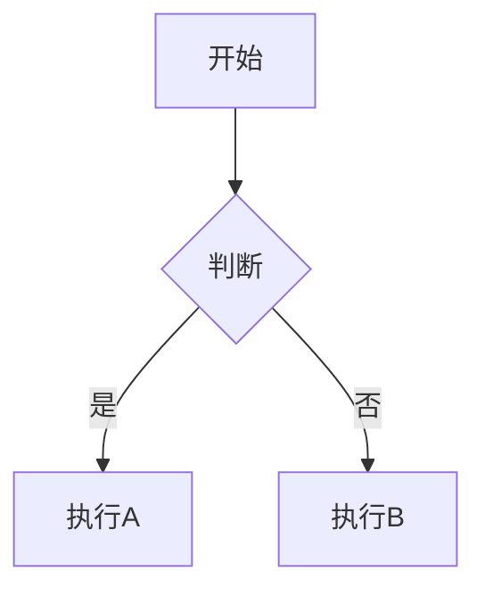

# Markdown转Word文档Skill

## 概述

此技能支持将Markdown文档转换为符合中国法律文书标准的专业格式Word文档。自动应用正确的排版、格式、间距和布局，同时保留所有Markdown元素，包括表格、图表、代码块和格式设置。

## 依赖要求

### Python 依赖

本技能需要以下 Python 库：

| 包名 | 版本要求 | 用途 |
|:---|:---|:---|
| python-docx | >= 0.8.11 | Word 文档操作 |
| Pillow | >= 9.0.0 | 图片处理 |
| beautifulsoup4 | >= 4.9.0 | HTML 解析 |
| PyYAML | >= 6.0 | 配置文件解析 |

### 安装方法

```bash
# 使用 pip 安装所有依赖
pip install python-docx Pillow beautifulsoup4 PyYAML

# 或使用 pipenv
pipenv install python-docx Pillow beautifulsoup4 PyYAML

# 或使用 poetry
poetry add python-docx Pillow beautifulsoup4 PyYAML
```

### 可选依赖

如需 Mermaid 图表渲染支持，需要安装：

```bash
# 安装 Mermaid CLI (需要 Node.js)
npm install -g @mermaid-js/mermaid-cli
```

### 系统要求

- **Python 版本**: Python 3.7+
- **推荐版本**: Python 3.10+
- **操作系统**: macOS / Linux / Windows

## 核心功能

### 格式标准
自动应用中国法律文书格式标准：

- **页面设置**: A4纸张 (21cm × 29.7cm)，上下边距2.54cm，左右边距3.18cm
- **字体规范**: 中文使用仿宋_GB2312，英文使用Times New Roman，统一黑色
- **字号标准**: 正文小四 (12pt)，一级标题小三 (15pt)，表格内容五号 (10.5pt)
- **段落格式**: 1.5倍行距，首行缩进2字符，两端对齐
- **标题格式**: 一级标题居中加粗，二级标题加粗左对齐

### Markdown元素支持
完整支持Markdown到Word的格式转换：

1. **标题处理**: 将`#`到`######`自动转换为对应级别的Word标题样式
2. **列表转换**: 无序列表使用•符号，有序列表保持数字编号，任务列表使用☐/☑
3. **表格转换**: Markdown表格转换为带边框的Word表格，自动调整列宽
4. **代码块**: 支持语法高亮，使用等宽字体和灰色背景
5. **引用块**: 添加灰色底色和左侧缩进
6. **文本格式化**: 支持**加粗**、*斜体*、<u>下划线</u>、~~删除线~~

### 高级功能
处理高级文档元素：
- **Mermaid图表**: 本地渲染为高清PNG图片插入文档
- **HTML表格**: 支持HTML表格语法转换
- **图片处理**: 自动调整大小，保持文档协调性
- **页码设置**: 自动添加页脚页码(1/x格式)
- **引号转换**: 英文引号自动转换为中文引号“”和‘’

## 使用方法

### 基本命令格式
执行基础转换：
```bash
# 使用默认配置（法律文书格式）
python md2word.py input.md

# 指定输出文件
python md2word.py input.md output.docx

# 使用预设配置
python md2word.py input.md --preset=academic    # 学术论文格式
python md2word.py input.md --preset=report      # 工作报告格式
python md2word.py input.md --preset=simple      # 简单文档格式

# 使用自定义配置文件
python md2word.py input.md --config=my-config.yaml

# 列出所有可用预设
python md2word.py --list-presets
```

### 配置系统
技能支持灵活的配置系统，内置多种预设格式：

#### 内置预设
- **legal**: 法律文书格式（默认）- 仿宋_GB2312，小四号，1.5倍行距
- **academic**: 学术论文格式 - 宋体，小四号，双倍行距
- **report**: 工作报告格式 - 黑体标题，仿宋正文，1.5倍行距
- **simple**: 简单文档格式 - 无特殊格式要求

#### 自定义配置
创建自定义格式配置文件（YAML）：
```bash
# 1. 复制配置模板
cp md2word/assets/config-template.yaml my-config.yaml

# 2. 编辑配置文件
vim my-config.yaml

# 3. 使用自定义配置
python md2word.py input.md --config=my-config.yaml
```

#### Word模板文件
使用 Word 模板文件（.docx）可以预设页眉、页脚图片等元素：
```bash
# 将 .docx 模板文件放入 md2word/assets/templates/ 目录
# 程序会自动发现并使用模板
cp my_template.docx md2word/assets/templates/

# 或在命令中指定模板
python md2word.py input.md --template=my_template.docx
```

**Word模板 vs 配置文件的区别**：
- **Word模板 (.docx)**: 预设文档结构、页眉、页脚图片、公司Logo等视觉元素
- **配置文件 (YAML)**: 控制格式参数，如字号、行距、页边距、字体等排版规则

两者可以同时使用：配置文件控制排版格式，Word模板提供视觉元素。

### 在Claude Code中使用
在Claude Code中将Markdown文档转换为Word格式：

1. **简单转换**: 执行 `skill: "md2word"` 转换当前目录下的Markdown文件
2. **指定输入**: 运行 `skill: "md2word" with {"input": "contract.md"}`
3. **完整参数**: 使用 `skill: "md2word" with {"input": "contract.md", "output": "contract_final.docx", "template": "legal_template.docx"}`

### 模板文件使用
应用模板文件保持格式一致性：

1. **自动发现**: 程序自动查找同目录下包含'模板'或'template'的.docx文件
2. **手动指定**: 在命令中指定模板文件路径
3. **模板保留**: 保留页面设置和基础样式，仅替换内容

## 工作流程

### 步骤1: 准备Markdown文件
使用正确的格式创建Markdown文档：
```markdown
# 合同标题

## 第一条 条款内容

**重要条款**: 这里是具体的条款内容。

### 子条款

1. 第一点内容
2. 第二点内容

| 项目名称 | 要求 | 备注 |
|----------|------|------|
| 项目A | 高质量 | 必须 |
| 项目B | 标准 | 可选 |
```

### 步骤2: 执行转换
运行转换命令：
```bash
/skill md2word contract.md contract.docx
```

### 步骤3: 检查输出
生成的Word文档将包含：
- 专业的法律文书格式
- 完整的表格边框
- 正确的字体和字号
- 标准的段落缩进
- 自动页码和页脚

## 处理特殊元素

### Mermaid图表
处理Markdown中的Mermaid图表：
```markdown

```

处理流程：
1. 尝试本地渲染为PNG图片
2. 如失败则转换为文本描述
3. 自动调整图片大小适应页面

### 复杂表格
处理带格式的表格：
```markdown
| **加粗** | *斜体* | 普通 |
|----------|--------|------|
| <u>下划线</u> | ~~删除线~~ | `代码` |
```

表格单元格内的所有格式都会在Word输出中保留。

### 引用和代码
处理引用块和代码块：
```markdown
> 这是一个引用块
> 可以包含多行内容

```python
def example():
    print("代码块")
```
```

## 错误处理

### 常见问题
- **文件编码**: 自动检测UTF-8和GBK编码
- **模板找不到**: 使用默认格式创建新文档
- **Mermaid失败**: 降级为文本描述
- **图片过大**: 自动压缩和调整尺寸

### 调试信息
技能提供详细的处理信息：
- 显示每个处理步骤的状态
- 统计引号转换情况
- 报告表格和图表处理结果
- 显示最终格式设置详情

## 脚本和资源配置

### 主转换脚本
技能包含基于成熟md2word.py实现的主转换脚本：

```python
# 核心功能在 scripts/md2word.py 中实现
# 支持完整的Markdown到Word转换
# 包含所有格式化和排版功能
```

使用转换功能：
1. 确保Python环境安装了所需依赖
2. 调用主脚本进行转换
3. 自动应用所有格式设置

### 模板文件
模板文件应该放置在 `assets/` 目录中：
- **法律模板.docx**: 标准法律文书格式模板
- **合同模板.docx**: 合同文档专用模板
- **报告模板.docx**: 技术报告格式模板

**模板使用说明**：
- 将自定义的Word模板文件(.docx)放入 `assets/` 文件夹
- 程序会自动发现同目录下的模板文件
- 优先使用文件名包含'模板'或'template'的文件
- 也可以在命令中手动指定模板路径

**创建模板建议**：
1. 设置好页面大小(A4)和页边距
2. 定义默认字体(仿宋_GB2312)和字号
3. 创建标准的标题和正文样式
4. 保存为.docx格式放入assets目录

### 配置选项详解
所有可配置的格式参数：

#### 页面和字体
- 页面尺寸、页边距
- 中英文字体、字号、颜色

#### 标题格式
- 4级标题的字号、加粗、对齐方式、缩进、段前段后间距

#### 段落格式
- 行距、首行缩进、对齐方式

#### 页码设置
- 是否启用、格式(1/x)、字体、字号、位置

#### 表格格式
- 边框(启用/禁用、颜色、宽度)
- 行高、对齐方式、垂直对齐
- 单元格边距
- 标题行和正文格式(分别配置)

#### 代码块格式
- 语言标签(字体、字号、颜色)
- 代码内容(字体、字号、颜色、缩进、行距)

#### 行内代码
- 字体、字号、颜色

#### 引用块格式
- 背景颜色、左侧缩进、字号、行距

#### 数学公式
- 字体、字号、是否斜体、颜色

#### 图片设置
- 显示比例、最大宽度、目标DPI、是否显示标题

#### 分割线设置
- 字符、重复次数、字体、字号、颜色、对齐方式

#### 列表设置
- 无序列表(标记符号、缩进)
- 有序列表(缩进、保持格式)
- 任务列表(未完成/已完成标记)

### scripts/
包含主转换脚本和配置模块：
- **md2word.py**: 主转换脚本，支持完整的Markdown到Word转换
- **config.py**: 配置管理模块，支持YAML配置文件和预设加载
- **requirements.txt**: Python依赖包清单

### assets/
技能资源文件：
- **presets/**: 内置格式预设配置
  - **legal.yaml**: 法律文书格式预设
  - **academic.yaml**: 学术论文格式预设
  - **report.yaml**: 工作报告格式预设
  - **simple.yaml**: 简单文档格式预设
- **templates/**: Word模板文件（.docx）
  - 放置包含页眉、页脚图片、Logo等元素的 Word 模板
  - 程序自动查找并使用（优先使用文件名包含'模板'或'template'的文件）
- **config-template.yaml**: 配置文件模板（供用户复制自定义）

---

**Note**: This skill transforms the proven md2word.py functionality into a reusable Claude skill, providing professional document formatting capabilities for Chinese legal and business documents.
