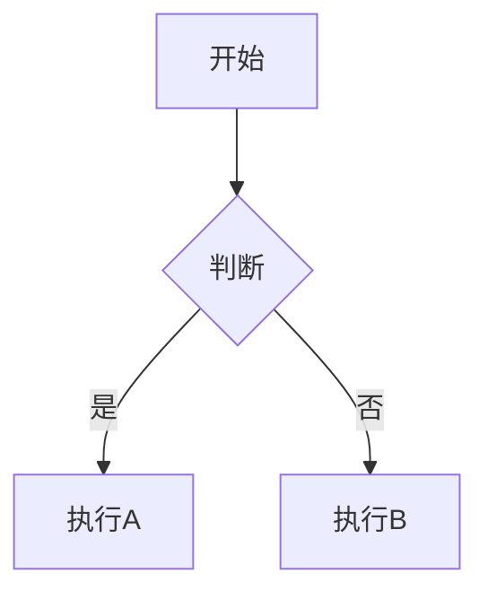

# 使用示例

本文档提供 md2word 技能的使用示例和常见场景。

## 基本转换

### 最简单的用法

```bash
# 转换当前目录下的 Markdown 文件
python scripts/md2word.py document.md
```

输出：`document_完整版.docx`

### 指定输出文件名

```bash
python scripts/md2word.py input.md output.docx
```

---

## 使用预设格式

### Legal 预设（正式文档格式）

```bash
python scripts/md2word.py contract.md --preset=legal
```

**适用场景**：合同、正式函件、法律文书

**格式特点**：
- 字体：仿宋_GB2312
- 字号：小四 (12pt)
- 行距：1.5 倍
- 页边距：上下 2.54cm，左右 3.18cm

### Academic 预设（学术论文格式）

```bash
python scripts/md2word.py thesis.md --preset=academic
```

**适用场景**：学术论文、研究报告

**格式特点**：
- 字体：宋体
- 字号：小四 (12pt)
- 行距：2.0 倍（双倍行距）

### Report 预设（工作报告格式）

```bash
python scripts/md2word.py report.md --preset=report
```

**适用场景**：工作报告、总结报告

**格式特点**：
- 标题：黑体
- 正文：仿宋_GB2312
- 行距：1.5 倍

### Simple 预设（简单文档格式）

```bash
python scripts/md2word.py notes.md --preset=simple
```

**适用场景**：内部文档、笔记草稿

**格式特点**：基础格式，无特殊要求

---

## 自定义配置

### 创建自定义配置

1. 复制配置模板：

```bash
cp assets/config-template.yaml my-config.yaml
```

2. 编辑配置文件：

```yaml
name: "我的自定义格式"
description: "自定义的文档格式"

page:
  width: 21.0
  height: 29.7
  margin_top: 2.5
  margin_bottom: 2.5
  margin_left: 3.0
  margin_right: 3.0

fonts:
  default:
    name: "宋体"
    ascii: "Times New Roman"
    size: 12
    color: "#000000"
```

3. 使用自定义配置：

```bash
python scripts/md2word.py document.md --config=my-config.yaml
```

### 基于预设修改

```bash
# 复制预设作为起点
cp assets/presets/legal.yaml my-format.yaml

# 编辑后使用
python scripts/md2word.py document.md --config=my-format.yaml
```

---

## 使用 Word 模板

### 自动发现模板

将 `.docx` 模板文件放入 `assets/templates/` 目录，程序会自动查找。

文件名包含"模板"或"template"的文件优先使用。

### 手动指定模板

```bash
python scripts/md2word.py document.md --template=my-template.docx
```

### 模板用途

Word 模板用于：
- 预设页眉、页脚（如公司 Logo）
- 预设文档结构
- 保留特定的样式设置

> 注意：模板文件控制视觉元素，配置文件控制格式参数

---

## 常见场景

### 场景 1：合同文档转换

```bash
# 使用 legal 预设
python scripts/md2word.py contract.md --preset=legal

# 如果有公司模板
python scripts/md2word.py contract.md --preset=legal --template=company-template.docx
```

### 场景 2：学术论文转换

```bash
# 使用 academic 预设
python scripts/md2word.py paper.md --preset=academic output-paper.docx
```

### 场景 3：批量转换当前目录所有 Markdown 文件

```bash
# 不指定输入文件，自动处理所有 .md 文件
python scripts/md2word.py --preset=legal
```

### 场景 4：使用完全自定义的格式

```bash
# 先创建自定义配置
cat > my-custom.yaml << 'EOF'
name: "自定义格式"
fonts:
  default:
    name: "微软雅黑"
    size: 11
paragraph:
  line_spacing: 1.3
EOF

# 使用自定义配置转换
python scripts/md2word.py document.md --config=my-custom.yaml
```

### 场景 5：查看可用预设

```bash
python scripts/md2word.py --list-presets
```

输出示例：
```
可用的预设配置:
  - academic: 学术论文格式 - 宋体，小四号，双倍行距
  - legal: 正式文档格式 - 仿宋_GB2312，小四号，1.5倍行距
  - report: 工作报告格式 - 黑体标题，仿宋正文，1.5倍行距
  - simple: 简单文档格式 - 无特殊格式要求
```

---

## 输入文件格式示例

### 基本文档结构

```markdown
# 文档标题

## 第一条 条款内容

这是正文段落，首行会自动缩进两个字符。

### 子条款

1. 有序列表项
2. 另一项

**重点内容**可以加粗显示。

| 项目 | 说明 |
|:-----|:-----|
| 项目A | 说明A |
| 项目B | 说明B |

> 这是引用块内容

```python
def example():
    print("代码块")
```
```

### 支持的 Markdown 元素

- **标题**：`#` 到 `######`
- **列表**：无序 (`*`, `-`, `+`)、有序 (`1.`)、任务 (`- [ ]`)
- **表格**：Markdown 表格语法
- **代码块**：三反引号包裹
- **引用块**：`>` 开头
- **文本格式**：`**加粗**`、`*斜体*`、`<u>下划线</u>`、`~~删除线~~`
- **数学公式**：`$公式$`
- **分割线**：`---`、`***`、`___`
- **图片**：``
- **Mermaid 图表**：```mermaid ... ```

---

## 高级功能

### Mermaid 图表

输入：

```markdown

```

程序会自动将 Mermaid 图表渲染为图片插入 Word 文档。

### 表格格式保留

输入：

```markdown
| **加粗** | *斜体* | 普通 |
|----------|--------|------|
| <u>下划线</u> | ~~删除线~~ | `代码` |
```

表格中的所有格式都会在 Word 输出中保留。

---

## 常见问题

### Q: 如何修改字号？

A: 编辑自定义配置文件，修改 `fonts.default.size` 参数。

### Q: 如何调整行距？

A: 编辑自定义配置文件，修改 `paragraph.line_spacing` 参数。

### Q: 如何不自动添加页码？

A: 在配置文件中设置 `page_number.enabled: false`。

### Q: 英文引号会自动转换吗？

A: 是的，默认会自动将英文引号转换为中文引号。可在配置中设置 `quotes.convert_to_chinese: false` 禁用。
