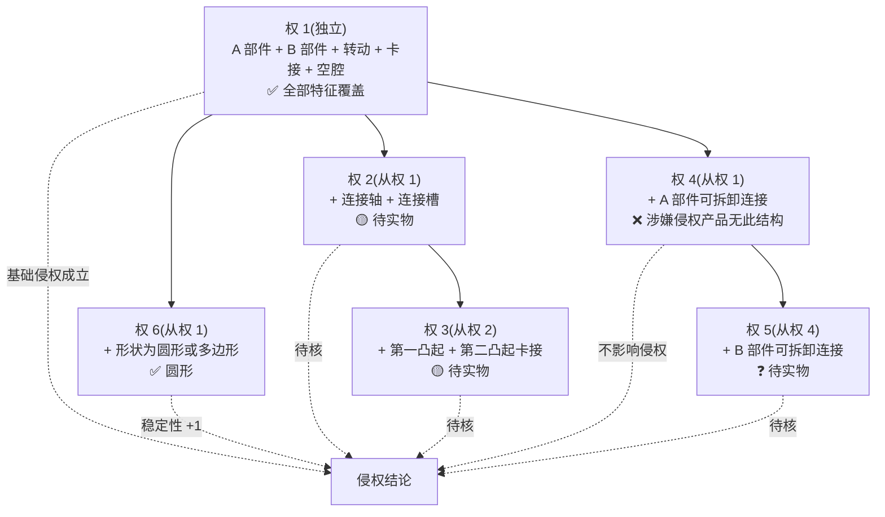
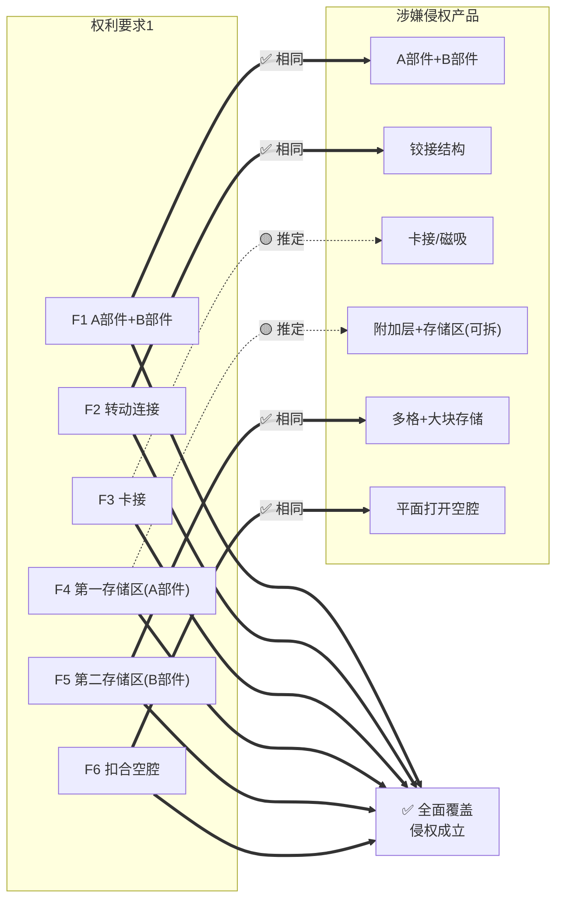

# 场景八:可视化输出模板

> 适用:在侵权比对分析、案件汇报、客户沟通中将权利要求与涉嫌侵权产品的关系可视化呈现。
> 设计原则:**特征拆解清楚 + 法律关系准确 + 视觉直观**。

本场景提供 2 套核心可视化模板,均直接可用于法律服务方案、案件分析文档、诉讼代理意见等对外文书。

---

## 模板 1:权利要求特征洋葱图(从属权利要求层级图)

### 适用场景

向客户/法官/团队解释"为什么主张权 1 + 多个从属权利要求"的战略价值:
- 客户层面:让非专业人士理解"为什么一个专利能有好几层保护"
- 法官层面:清晰展示"涉案产品落入了独立权利要求 1,且进一步落入了从属权利要求 2、3、6"
- 团队层面:讨论侵权稳定性、应对无效宣告时的后备阵地

### 图示(以"某铰接装置"专利为例,便于理解结构层级)

```
                    ┌──────────────────────────────┐
                    │  权 6(从权 1)                │
                    │  A 部件 + B 部件的形状       │
                    │  落入:✅ 圆形                 │
                    └────────────────┬─────────────┘
                                     │
        ┌────────────────────────────┼────────────────────────────┐
        │                            │                            │
┌───────┴──────────┐    ┌────────────┴──────────┐    ┌────────────┴──────────┐
│  权 4(从权 1)    │    │  权 1(独立权利要求)     │    │  权 5(从权 4)        │
│  A 部件可拆卸    │    │  A 部件 + B 部件        │    │  B 部件可拆卸        │
│  落入:❌(无此结构)│    │  + 转动连接 + 卡接 + 空腔│    │  落入:❓ 待实物       │
│                  │    │  落入:✅✅✅🟡✅         │    │                      │
└───────┬──────────┘    │  基础侵权成立 ✅         │    └────────────┬──────────┘
        │               └────────────┬──────────┘                 │
        │                            │                            │
        │               ┌────────────┴──────────┐                 │
        │               │  权 2(从权 1)         │                 │
        │               │  转动连接的具体结构   │                 │
        │               │  (如连接轴+连接槽)    │                 │
        │               │  落入:🟡 待实物        │                 │
        │               └────────────┬──────────┘                 │
        │                            │                            │
        │               ┌────────────┴──────────┐                 │
        │               │  权 3(从权 2)         │                 │
        │               │  卡接的具体结构       │                 │
        │               │  (如凸起+凹槽)        │                 │
        │               │  落入:🟡 待实物        │                 │
        │               └───────────────────────┘                 │
        │                                                          │
        └──────────────────────────────────────────────────────────┘
                                │
                                ▼
            侵权稳定性结论:权 1 落入 + 权 6 落入 = 中等
            (权 2/3/4/5 待实物核实;权 1 存在被无效风险,需应对预案)
```

### Markdown 实现(更标准的方案)

使用层级表格替代 ASCII 图,在 Markdown 文档中渲染更稳定:

```markdown
## 权利要求层级分析(以"某铰接装置"专利为例)

| 层级 | 权利要求 | 关系 | 附加技术特征 | 涉嫌侵权产品是否落入 | 战略意义 |
|------|----------|------|--------------|----------------------|----------|
| L0 | 权 1(独立) | 基准 | A 部件 + B 部件 + 转动连接 + 卡接 + 空腔 | ✅ 推定全部特征覆盖 | 基础侵权成立 |
| L1 | 权 6(从权 1) | +形状 | 圆形或多边形 | ✅ 圆形 | 稳定性 +1 |
| L1 | 权 4(从权 1) | +可拆卸 | A 部件可拆卸 | ❌ 涉嫌侵权产品无此结构 | 不影响侵权判断 |
| L2 | 权 5(从权 4) | +可拆卸 | B 部件可拆卸 | ❓ 待实物 | 待核 |
| L1 | 权 2(从权 1) | +连接结构 | 转动连接的具体结构(连接轴+连接槽) | 🟡 待实物 | 待核 |
| L2 | 权 3(从权 2) | +卡接结构 | 卡接的具体结构(凸起+凹槽) | 🟡 待实物 | 待核 |

### 稳定性结论

- **已确认落入**:权 1、权 6 → 基础侵权 + 1 项从属
- **待核实**:权 2、权 3、权 5 → 公证购买后逐项核验
- **未落入(不影响侵权)**:权 4 → 因涉嫌侵权产品的"可拆卸"特征不涉及 A 部件
- **综合稳定性**:🟠 中等 — 权 1 基础侵权成立,但权 1 被无效时,权 4/5(可拆卸)这条线可能也受影响,需准备权利要求合并预案
```

### Mermaid 实现(适合在 Mermaid 渲染器中查看)



---

## 模板 2:侵权比对双栏图(权利要求 vs 涉嫌侵权产品)

### 适用场景

- 客户沟通:让客户一眼看懂"对方哪里侵权了"
- 律师函附件:作为对方了解侵权事实的可视化材料
- 起诉状/代理意见:作为侵权主张的视觉化支撑
- 内部讨论:团队快速判断侵权成立的关键争议点

### Markdown 实现(推荐,可直接复用)

```markdown
## 权利要求 1 vs 涉嫌侵权产品 特征比对

| 权 1 技术特征 | 涉嫌侵权产品对应结构 | 状态 | 比对说明 |
|--------------|----------------------|------|----------|
| **F1**:包括 A 部件和 B 部件 | A 部件(外壳)+ B 部件(外壳) | ✅ 相同 | 视频/图片清晰可见 A、B 两个部件 |
| **F2**:A 部件一端**转动连接**在 B 部件上 | 视频可见铰链结构 | ✅ 相同 | 铰接点位于 A 部件一端,与"转动连接"功能相同 |
| **F3**:A 部件另一端**卡接**在 B 部件上 | 产品功能可正常开合 + 说明书广义"卡接" | 🟡 推定 | 必有卡接/磁吸结构(否则无法开合),具体形式待实物 |
| **F4**:A 部件设置**第一存储区** | 客户陈述 + 拆解展示图 + 视频拆卸过程 | 🟡 推定 | 拆下附加层后确有存储区;说明书扩大解释空间 |
| **F5**:B 部件设置**第二存储区** | 视频可见 B 部件多格/大块存储结构 | ✅ 相同 | 明确为存储区结构,与"第二存储区"特征对应 |
| **F6**:扣合时两存储区之间**空腔** | 视频显示产品"平面打开"状态,两区之间留有空间 | ✅ 相同(推定) | "空腔"为容纳操作空间,产品形态可推定 |

### 全面覆盖结论

- **必要技术特征总数**:6 个
- **已明确覆盖**:3 个(F1、F2、F5)
- **推定覆盖(待公证实物)**:3 个(F3、F4、F6)
- **未覆盖**:0 个

**初步判断**:涉嫌侵权产品(拆下可拆卸附加层后)落入权利要求 1 全部 6 项技术特征的保护范围,具备构成相同侵权的证据基础。

### 多出特征分析(对方可能抗辩点)

| 涉嫌侵权产品多出的特征 | 是否影响侵权认定 | 说明 |
|----------------------|------------------|------|
| 可拆卸附加层(覆盖在第一存储区上) | ❌ 不影响 | "多出特征不免除侵权"原则,附加层是附加结构,不否定"A 部件有第一存储区"的事实 |
| B 部件多格细分存储 | ❌ 不影响 | 说明书明确"存储区内部排布方式不受限" |
| 附送配件(如装饰物、刷具等) | ❌ 不影响 | 与存储区结构无关 |
| 特定外观设计(如颜色、材质) | ❌ 不影响 | 外观特征,与权利要求结构特征无关 |
```

### Mermaid 双向对照图(适合在线/PPT 场景)



---

## 使用建议

1. **对外文书(律师函、起诉状)**:用 Markdown 双栏图 + 洋葱图层级表,打印为 A4 附件
2. **客户演示**:用 Mermaid 双向对照图,投屏/PPT 演示更直观
3. **内部讨论**:用 ASCII 洋葱图,白板/便签都能画
4. **法律服务方案**:洋葱图用于"案件稳定性评估"章节,双栏图用于"侵权比对"章节
5. **公众号/对外文章**:用 Mermaid 渲染后截图,避免 Markdown 表格在公众号错位

## 注意事项

1. **状态标注必须规范**:✅ 相同 / 🟡 推定 / ❌ 不同 / ❓ 待核实,四种状态清晰区分
2. **待核实特征必须标注来源**:不能写"待核实"了事,要写"基于客户陈述/视频/图片,待公证实物最终确认"
3. **多出特征不忽略**:对方可能主张"我们有这些专利没有的特征"作为抗辩,必须正面回应
4. **不夸大也不缩小**:有充分证据就标注 ✅,有合理怀疑就标注 🟡,证据不足就标 ❓,不能凭主观倾向调整

---

*可视化模板与法律服务方案(proposal-generator)、案件分析摘要(case-analysis-summary) 等文档生成 skill 配合使用效果最佳。*
